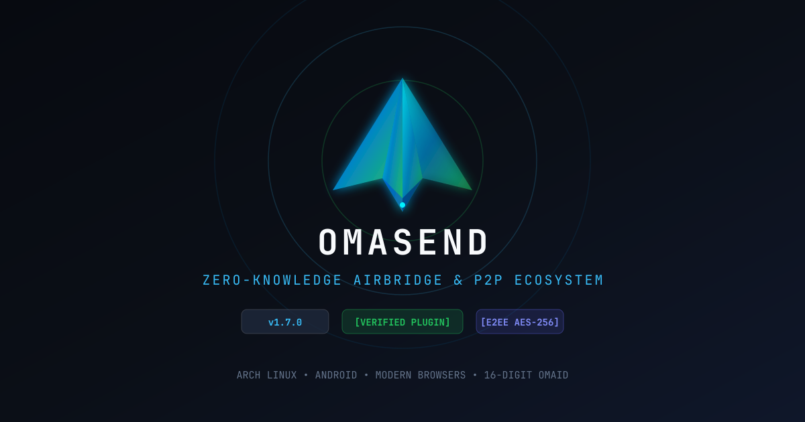

# OmaSend - Omarchy Linux İçin Sıfır Bilgili AirBridge ve E2EE Aktarım Merkezi

[](https://github.com/ozdil)
[](https://github.com/ozdil/omarchy-omasend/releases)
[](https://buymeacoffee.com/ozdil)
[](LICENSE)



> **Omarchy Linux, Android ve Modern Web Tarayıcıları arasında cihazlar arası egemen dosya aktarımı, şifreli pano kasası, 16 haneli Luhn OmaID eşleşmesi ve Sıfır Bilgili AES-256-GCM uçtan uca şifrelemeli küresel WAN portalı.**

- **Geliştirici:** Ozan Özdil (ozdil)  
- **Lisans:** MIT  
- **Eklenti Kimliği:** `ozdil.omasend`  
- **Sürüm:** `1.7.0`  
- **Varsayılan Yazı Tipi:** `JetBrainsMono Nerd Font`

---

## Öne Çıkan Yetenekler

- **16 Haneli Luhn Mod 10 OmaID Eşleşmesi ve Kör Randevu (Blinded Rendezvous):**
  - Sıfır hesap, sıfır merkezi sunucu: RFC 2104 HMAC-SHA256 Blinded Rendezvous konuları ve RFC 5869 HKDF-SHA256 simetrik anahtar türetimi ile güvenli eşleşme.
  - Luhn mod 10 sağlama toplamı doğrulamalı 16 haneli P2P cihaz kimlikleri (`XXXX-XXXX-XXXX-XXXX`).
  - Katı sıfır güven (Zero-Trust) filtresi: Eşleşmemiş veya yetkisiz cihazlardan gelen istekler bellek veya diske yazılmadan HTTP 403 ile engellenir.
- **Evrensel Çok Formatlı Pano Kasası ve WebP Mikro Önizleme Motoru:**
  - Metin ve görsel verilerini (PNG, JPEG, WebP) masaüstü ile mobil arasında çift yönlü ve anlık senkronize eder.
  - Dahili WebP Mikro Önizleme Motoru: Kopyalanan görseller için izole sandbox içinde otomatik olarak 96x96 piksel ultra hafif önizlemeler (~3-5 KB) üretir; büyük dosyalar indirilmeden sıfır gecikmeli görsel sunumu sağlar.
  - Kompakt Pano Kasası Arayüzü: Tek tıklamayla panoya kopyalama, çift tıklamayla tam ekran önizleme ve `~/Pictures/OmaStudio_Exports/` dizinine anında aktarım.
  - Güvenli İzolasyon: `~/.local/state/omarchy/omasend/clip_staging/` altında atomik 0600 dosya izinleri ve 50 MiB LRU temizleme sınırı.
- **Omarchy AirBridge P2P (Masaüstü, Android ve Web Doğrudan Aktarım):**
  - Sıfır Tıklamalı Anında Aktarım: Eşleşmiş ve güvenilir cihazlardan gelen transferler manuel onay beklemeden, doğrudan diske 0600 izinleriyle akıtılır.
  - Donanım hızlandırmalı dairesel sonar radar görselleştirmesi.
  - Sıfır Yapılandırmalı Keşif: Yerel ağdaki Omarchy Linux masaüstü ve Android cihazları UDP işaretçileri (53317 portu) ile otomatik keşfeder.
  - 3 Kademeli Görünürlük Kontrolü: Kapalı (Off), Yalnızca Tanınanlar (Known - Varsayılan) ve Herkes (Everyone - 10 dakikalık geçici keşif).
- **Sıfır Bilgili Uçtan Uca Şifreleme (E2EE):**
  - Donanım hızlandırmalı AES-256-GCM şifreleme ve BLAKE3 kriptografik bütünlük sağlama toplamı.
  - Oturum anahtarı URL'nin karma (`#key=...`) bölümünde taşınır; HTTP istek başlıklarına veya sunucu kayıtlarına asla ulaşmaz (RFC 3986).
- **Çoklu Platform Ekosistemi:**
  - **Linux Masaüstü Eklentisi:** Yerel Quickshell QML widget'ı ve sertleştirilmiş Rust arka plan motoru (`omasend-engine`).
  - **Android Yerel Uygulaması:** Kotlin ve Jetpack Compose ile sıfır GMS bağımlılıklı CameraX QR/Barkod vizörü ve dokunsal titreşim desteği ([ozdil/omasend-android](https://github.com/ozdil/omasend-android)).
  - **Web PWA İstemcisi:** Web Crypto API ve çevrimdışı Service Worker önbelleklemesi sunan kurulumsuz web istemcisi ([ozdil/omasend-web](https://github.com/ozdil/omasend-web)).
- **Sertleştirilmiş HANCORE Rust Motoru:**
  - Omarchy Linux Güvenlik Standartları ile tam uyum: Ayrı süreç grupları (`process_group(0)`), monoton yürütme sınırları, atomik geçici dosya yazımları (0600), `prctl(PR_SET_DUMPABLE, 0)` ve bellek sıfırlama (`Zeroize`).

---

## Sistem Gereksinimleri

- `cargo` ve `rustc` (Rust derleme zinciri, motor inşası için)
- `quickshell` (Omarchy masaüstü panel çalışma zamanı)
- `wl-clipboard` (Wayland pano komutları `wl-copy` ve `wl-paste` için)
- `libnotify` (Masaüstü bildirimleri için `notify-send`)
- `zenity` (GTK dosya seçim diyaloğu)
- `cloudflared` (Opsiyonel, Küresel WAN Tünel modu için)

---

## Kurulum ve Başlatma

### 1. Adım: Eklentiyi Omarchy'ye Ekleyin
```bash
omarchy plugin add https://github.com/ozdil/omarchy-omasend.git
```

### 2. Adım: Yerel Motoru Derleyin
Eklenti dizinine giderek otomatik kurulum betiğini çalıştırın:
```bash
cd ~/.config/omarchy/plugins/ozdil.omasend && ./build.sh
```
Bu betik motoru `cargo build --release --locked` ile derler, `omasend-engine` ikilisini 0755 izinleriyle kurar, kriptografik doğrulamayı yapar ve Omarchy kabuğunu otomatik olarak yeniden başlatır.

### 3. Adım: Üst Bara Yerleştirme (Opsiyonel)
Panelde otomatik görünmezse `~/.config/omarchy/shell.json` dosyasındaki `bar.layout.right` dizisine `ozdil.omasend` ekleyin:
```json
{
  "id": "ozdil.omasend"
}
```
Ardından kabuğu yeniden yükleyin:
```bash
omarchy-restart-shell
```

---

## Çoklu Platform Bağlantıları

- **Android Uygulaması:** [ozdil/omasend-android](https://github.com/ozdil/omasend-android)
- **Web PWA İstemcisi:** [ozdil/omasend-web](https://github.com/ozdil/omasend-web)
- **Google Play Kapalı Beta:** [Google Grubuna Katıl](https://groups.google.com/g/omasend-testers) & [Google Play Test Programına Katıl](https://play.google.com/apps/testing/io.omarchy.omasend)

---

## Güvenlik ve Gizlilik Politikası

OmaSend katı bir **Sıfır Güven (Zero-Trust) ve Sıfır Bilgi (Zero-Knowledge)** mimarisiyle çalışır. Telemetri toplamaz, kullanıcıları izlemez veya merkezi aracılar üzerinden veri aktarmaz. Tüm iletişimler doğrudan uçtan uca şifrelenir veya yerel ağda noktadan noktaya (P2P) yürütülür.

Detaylı güvenlik ilkeleri için [PRIVACY_POLICY.md](PRIVACY_POLICY.md) ve [CONTRIBUTING.md](CONTRIBUTING.md) belgelerini inceleyin.

---

## Lisans

Bu proje **MIT Lisansı** ile lisanslanmıştır. Detaylar için [LICENSE](LICENSE) dosyasına bakın.
